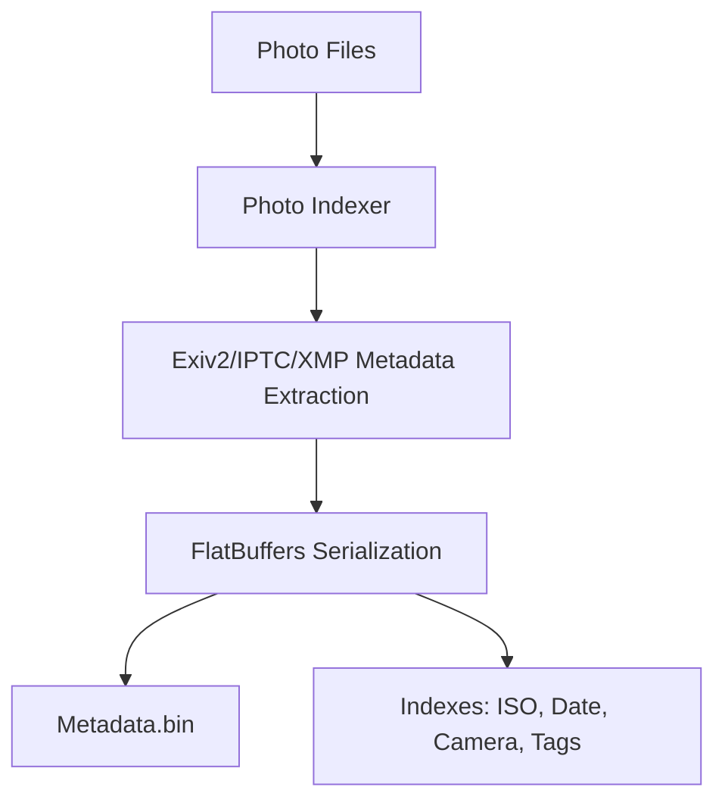

# Photo Indexer

A high-performance C++23 photo metadata indexer designed to scan directories, extract comprehensive metadata (EXIF, IPTC, XMP), and generate efficient FlatBuffers-based indexes.

## Overview

The `photo_indexer` tool is a core component of the CPP_Webgallery backend. It processes photo collections by:

- Recursively scanning for supported image formats.
- Extracting metadata using the `Exiv2` library.
- Serializing metadata into a compact binary format using `FlatBuffers`.
- Generating searchable indexes for ISO, Date, Camera Model, and Tags.

## Key Features

- **C++23 Core**: Leveraging modern language features like `<print>`, `std::ranges`, and more.
- **SIMD Optimized**: Support for AVX2 and FMA optimizations for significantly faster processing.
- **Multithreaded Processing**: Designed for efficiency in scanning large photo libraries.
- **FlatBuffers Serialization**: Ensures fast data loading and cross-language compatibility.
- **Comprehensive Metadata Support**: Extracts EXIF (including GPS), IPTC, and XMP data.
- **High-Performance Indexes**: Builds binary indexes optimized for gallery search and filtering using high-speed XXH3 string fingerprints.

## Requirements

- **Compiler**: GCC 13+, Clang 16+, or MSVC 2022+ (C++23 support required).
- **Build System**: CMake 3.28+.
- **Package Manager**: Conan 2.x.
- **Dependencies**:
  - `Exiv2`: For metadata extraction.
  - `FlatBuffers`: For data serialization.
  - `xxHash`: For fast XXH3 string fingerprints.

## Getting Started

### 1. Build the Project

```bash
conan install . --build=missing
cmake --preset conan-release
cmake --build --preset conan-release
```

### 2. Run the Indexer

```bash
./build/Release/photo_indexer <path_to_photos> <index_prefix>
```

## Architecture

A high-level overview of the system's architecture can be found in the [Architecture Overview](docs/architecture/readme.md).

### System Overview Diagram



For more complex diagrams (Class, Sequence, etc.), please refer to the `docs/architecture` directory.

## License

This project is licensed under the Apache License, Version 2.0. See the [LICENSE](LICENSE) and [NOTICE](NOTICE) files for details.

---

Copyright (c) 2026 ZHENG Robert
