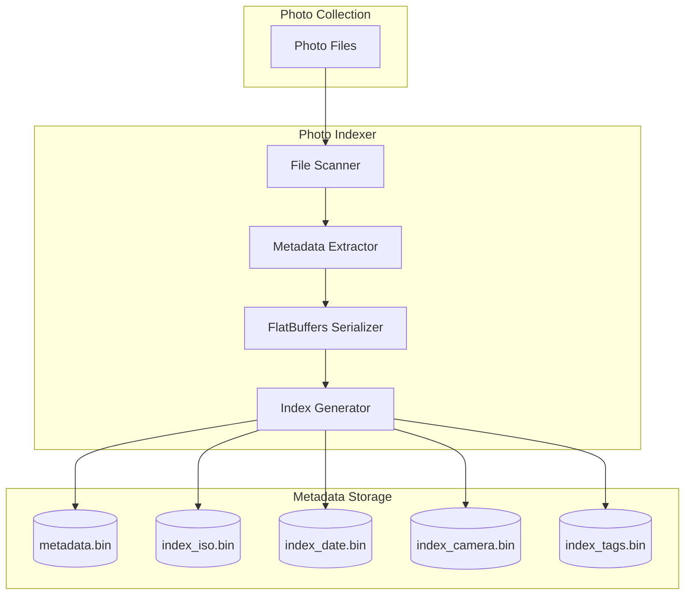
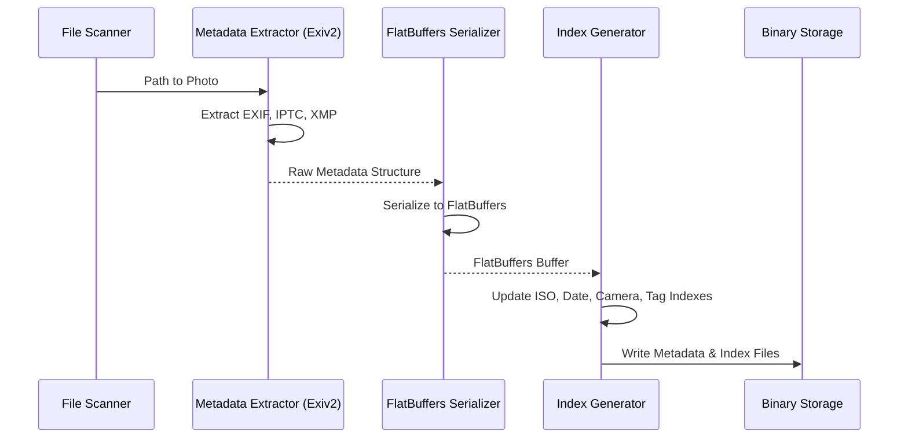

# Architecture Overview

This document provides a high-level overview of the `photo_indexer` architecture.

## Component Diagram

The following diagram shows the main components of the `photo_indexer` system:

## Sequence Diagram

The processing sequence for each photo is illustrated below:

## Data Model

The data model is defined in the FlatBuffers schema located at `schemas/metadata.fbs`. It is designed to be:
- **Efficient**: Minimal memory overhead and fast access.
- **Extendable**: New metadata fields can be added without breaking compatibility.
- **Standalone**: All necessary information for the gallery backend is contained in the binary files.
